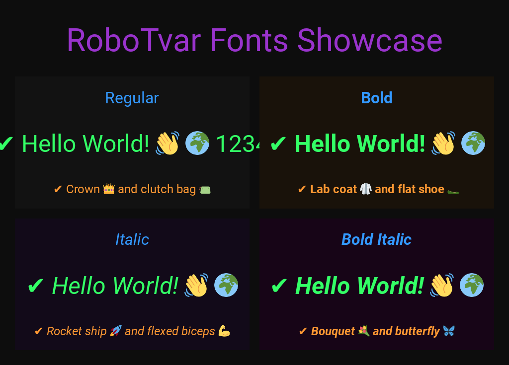

# RoboTvar

RoboTvar is a Python project that creates custom fonts by merging Roboto font variants with 
TossFace emoji font. The resulting fonts combine the elegance of Roboto typography with the 
expressive TossFace emojis.



## Motivation

This project addresses a problem which might arise when attempting to display text with emojis in a 
single `Label` widget. Typically, mixing regular text with emojis in a `kivy.uix.label.Label`'s 
`text` attribute might require more complex markup workarounds or multiple widgets. RoboTvar solves 
this by creating unified fonts that contain both text and emoji glyphs, allowing you to:

```python
from kivy.uix.label import Label

# Now you can simply do this:
label = Label(
    text="Hello World! 👋 🌍",
    font_name="RoboTvar"
)
```

The merged fonts ensure that both text and emojis render correctly within a single Label widget, 
maintaining proper alignment, spacing, and style consistency across your Kivy application.

## Features

- Seamless text and emoji display in Kivy Label widgets
- Multiple font styles for flexible typography:
  - [RoboTvar-Regular.ttf](https://github.com/patrikflorek/robotvar/blob/main/merged/RoboTvar-Regular.ttf)
  - [RoboTvar-Bold.ttf](https://github.com/patrikflorek/robotvar/blob/main/merged/RoboTvar-Bold.ttf)
  - [RoboTvar-Italic.ttf](https://github.com/patrikflorek/robotvar/blob/main/merged/RoboTvar-Italic.ttf)
  - [RoboTvar-BoldItalic.ttf](https://github.com/patrikflorek/robotvar/blob/main/merged/RoboTvar-BoldItalic.ttf)
- Automatic downloading of Roboto and TossFace fonts from their respective GitHub repositories
- Font merging with proper glyph conversion and metrics preservation
- Interactive Kivy-based test application for font preview
- Automatic screenshot capture of test results

## Installation

1. Clone the repository:
```bash
git clone https://github.com/patrikflorek/robotvar.git
cd robotvar
```

2. Create and activate a virtual environment:
```bash
python -m venv .venv
source .venv/bin/activate  # On Windows: .venv\Scripts\activate
```

3. Install dependencies:
```bash
pip install -r requirements.txt
```

## Usage

RoboTvar package provides a command-line interface with several operations:

### Download Fonts

Download required fonts from GitHub repositories:
```bash
python -m robotvar --download-only
```

### Merge Fonts

Merge downloaded fonts to create RoboTvar variants:
```bash
python -m robotvar --merge-only
```

You can specify a custom output directory:
```bash
python -m robotvar --merge-only --output-dir /path/to/output
```

### Test Application

Launch the interactive test application to preview the fonts:
```bash
python -m robotvar --test-app   
```

The test application automatically saves screenshots to `robotvar/screenshots/` when closed. 
Screenshots include samples of text and emojis in all four created font variants with different 
sizes and colors.

### Full Process

Run the complete process (download and merge) in one command:
```bash
python -m robotvar
```

## Project Structure

```
RoboTvar/
├── .venv/                     # Python virtual environment
├── requirements.txt           # Python dependencies
├── robotvar/                  # Main package directory
│   ├── __init__.py            # Package initialization
│   ├── __main__.py            # CLI entry point
│   ├── fonts/                 # Downloaded font files
│   │   ├── roboto/            # Roboto font variants
│   │   └── tossface/          # TossFace emoji font
│   ├── merged/                # Output directory for merged fonts
│   └── scripts/               # Package scripts
│       ├── __init__.py        # Scripts initialization
│       ├── download.py        # Font downloading functionality
│       ├── merge.py           # Font merging functionality
│       └── test_app.py        # Kivy test application
└── README.md                  # This file
```

## Dependencies

- Python 3.8+
- fonttools==4.56.0
- Kivy==2.3.1
- httpx==0.28.1

## Development

This project was primarily developed through AI-assisted pair programming using Claude 3.5 Sonnet, 
an AI coding agent by Anthropic. The AI agent helped with:

- Project structure and organization
- Implementation of font downloading and merging functionality
- Creation of the Kivy test application
- Documentation, README, and license generation

The development focused on achieving the first fully functional version of the package. While the 
current implementation successfully accomplishes its core objectives, there is plenty of room for 
code improvements, optimizations, and additional features in future iterations.

## Contributing

1. Fork the repository
2. Create your feature branch (`git checkout -b feature/amazing-feature`)
3. Commit your changes (`git commit -m 'Add amazing feature'`)
4. Push to the branch (`git push origin feature/amazing-feature`)
5. Open a Pull Request

## License

This project is licensed under the Apache License 2.0 - see the [LICENSE](LICENSE) file for details.

## Acknowledgments

- [Google Fonts](https://github.com/googlefonts/roboto-2) for the Roboto font family
- [Toss](https://github.com/toss/tossface) for the TossFace emoji font